<div align="center">

# 🎮 ArkZ Games

**Uma coleção de jogos clássicos que rodam dentro do AutoCAD.**


*Perfeitos para uma pausa no trabalho ou para testar os limites da personalização do CAD.*

</div>

---

## 📖 Sobre o projeto

O **ArkZ Games** é um plugin no formato **Application Bundle** (`ArkZGames.bundle`) para
o Autodesk AutoCAD. Ele adiciona uma aba **Ark-Z Games** à faixa de opções (Ribbon) com uma
coleção de jogos clássicos totalmente implementados em **AutoLISP** e **DCL**
(*Dialog Control Language*).

- 🧩 **100% nativo** — roda dentro do próprio AutoCAD, sem programas externos.
- 🔌 **Instalação automática** — empacotado no padrão oficial de plugins da Autodesk
  (`ApplicationPlugins`).
- 🖱️ **Interface gráfica (DCL)** — caixas de diálogo com *image buttons* e slides (`.slb`).
- 🤖 **Inteligência Artificial** — vários jogos possuem oponente controlado pelo computador.
- 🌎 **Português (pt-BR)** — interface e ajuda integralmente em português.

---

## 🕹️ Jogos disponíveis

| # | Jogo | Comando | Prévia |
|:-:|:-----|:--------|:------:|
| 1 | **Conecte-4** — alinhe N peças antes do computador | `Connect4` | [🖼️](Fonts/Contents/Resources/Conect4.png) |
| 2 | **Damas** — jogo de damas 8×8 contra IA | `Damas_8x8` | [🖼️](Fonts/Contents/Resources/Damas.png) |
| 3 | **Campo Minado** — revele as células sem minas | `Minesweeper_8x8` | [🖼️](Fonts/Contents/Resources/Minesweeper.png) |
| 4 | **Quebra-cabeça 3×3** (8-puzzle) | `Puzzle_3x3` | [🖼️](Fonts/Contents/Resources/Puzzle_3x3.png) |
| 5 | **Quebra-cabeça 4×4** (15-puzzle) | `Puzzle_4x4` | [🖼️](Fonts/Contents/Resources/Puzzle_4x4.png) |
| 6 | **Jogo 2048** — combine blocos até chegar a 2048 | `Game2048` | [🖼️](Fonts/Contents/Resources/game2048.png) |
| 7 | **Sudoku** — preencha a grade 9×9 seguindo a lógica | `Sudoku` | [🖼️](Fonts/Contents/Resources/Sudoku.png) |
| 8 | **Batalha Naval** — contra IA avançada | `SeaBattle_8x8` | [🖼️](Fonts/Contents/Resources/SeaBattle.png) |
| 9 | **Jogo da Velha 3×3** — jogador (X) × computador (O) | `TicTacToe_3x3` | [🖼️](Fonts/Contents/Resources/TicTacToe_3x3.png) |
| 10 | **Jogo da Velha 4×4** — versão em tabuleiro maior | `TicTacToe_4x4` | [🖼️](Fonts/Contents/Resources/TicTacToe_4x4.png) |
| 11 | **Torre de Hanói** — quebra-cabeça matemático clássico | `Hanoi` | [🖼️](Fonts/Contents/Resources/Hanoi.png) |
| 12 | **Wordle** — adivinhe a palavra de 5 letras em 6 tentativas | `Wordle` | [🖼️](Fonts/Contents/Resources/Wordle.png) |

> Todos os comandos também ficam disponíveis no grupo **Ark-Z Games** da faixa de opções
> e podem ser executados diretamente na linha de comando do AutoCAD.

---

## 📸 Capturas de tela

> Confira a seguir como cada jogo aparece dentro do AutoCAD.
> Clique em qualquer imagem para ampliá-la no tamanho original.

| | |
|:---:|:---:|
| 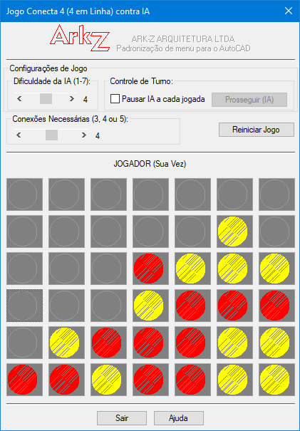<br>**Conecte-4**<br>`Connect4`<br>O objetivo é ser o primeiro jogador a obter uma sequência de N peças da sua cor (Jogador = Círculo 1 / Computador = Círculo 2) em linha reta. | 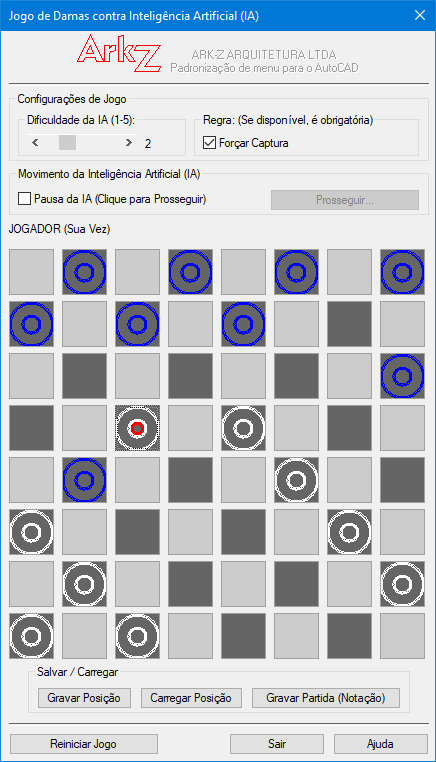<br>**Damas**<br>`Damas_8x8`<br>Jogo de Damas (Checkers) em um tabuleiro 8x8 contra uma Inteligência Artificial (IA). |
| 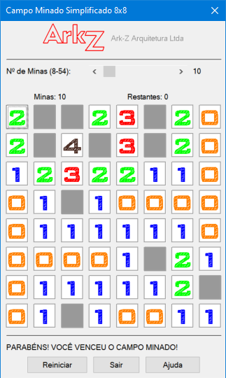<br>**Campo Minado**<br>`Minesweeper_8x8`<br>O objetivo é revelar todas as células do tabuleiro que NÃO contêm minas, usando as informações numéricas. | 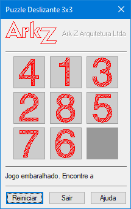<br>**Quebra-cabeça 3x3 (8-puzzle)**<br>`Puzzle_3x3`<br>Organize as peças numeradas de 1 a 8 em ordem crescente, deixando o espaço vazio no canto inferior direito. |
| 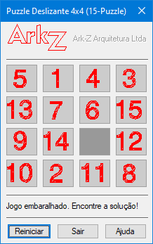<br>**Quebra-cabeça 4x4 (15-puzzle)**<br>`Puzzle_4x4`<br>Organize as peças numeradas de 1 a 15 em ordem crescente, deixando o espaço vazio no canto inferior direito. | 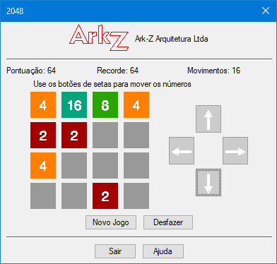<br>**Jogo 2048**<br>`Game2048`<br>Combine blocos com números iguais para criar o bloco 2048. |
| 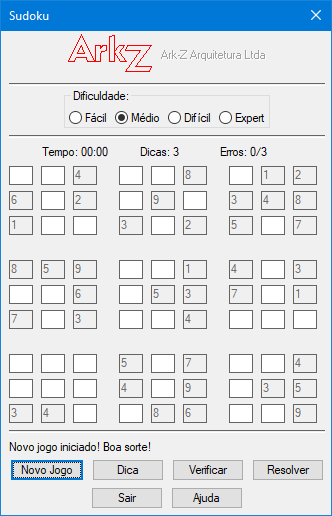<br>**Sudoku**<br>`Sudoku`<br>Preencha uma grade 9x9 com números de 1 a 9, seguindo as regras clássicas de lógica. | 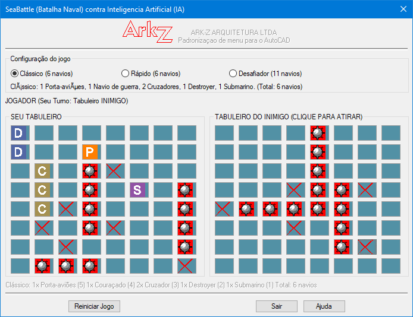<br>**Batalha Naval (Sea Battle)**<br>`SeaBattle_8x8`<br>Jogo completo de Batalha Naval contra uma Inteligência Artificial (IA) avançada. |
| 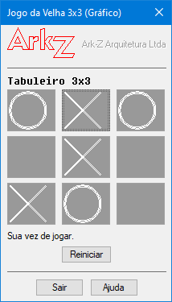<br>**Jogo da velha 3x3 (TicTacToe)**<br>`TicTacToe_3x3`<br>Clássico jogo da velha: jogador (X) contra o computador (O). | 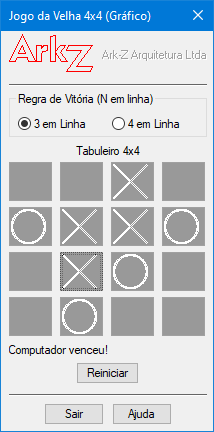<br>**Jogo da velha 4x4 (TicTacToe)**<br>`TicTacToe_4x4`<br>Jogador (X) contra computador (O) em um tabuleiro maior (4x4). |
| 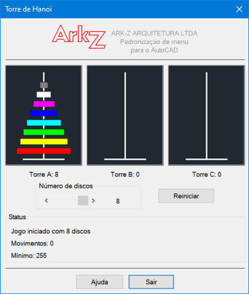<br>**Torre de Hanói**<br>`Hanoi`<br>Quebra-cabeça matemático clássico inventado por Édouard Lucas em 1883. | 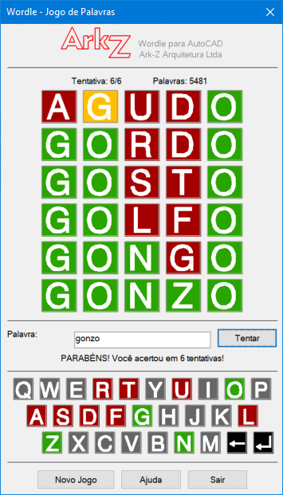<br>**Wordle**<br>`Wordle`<br>Adivinhe uma palavra secreta de 5 letras em até 6 tentativas. |

---

## 🖥️ Requisitos

| Item | Requisito |
|:-----|:----------|
| **Sistema operacional** | Windows (32-bit ou 64-bit) |
| **AutoCAD** | Versão **2013** (R19.0) até **2026** (R26.0) |
| **Produtos compatíveis** | AutoCAD, AutoCAD LT* e verticais baseadas no AutoCAD |
| **Arquitetura** | x86 / x64 |

> \* A compatibilidade plena depende dos recursos de DCL/AutoLISP disponíveis na versão.

---

## 📦 Instalação

### Opção 1 — Instalador (recomendado) ⭐

1. Baixe o instalador mais recente em **[Releases](../../releases/latest)**:
   `ArkZGames_v_260912_Setup.exe`.
2. Execute o instalador e siga o assistente.
3. Feche e reabra o **AutoCAD**.

O instalador copia o bundle para:

```text
C:\Program Files\Autodesk\ApplicationPlugins\ArkZGames.bundle\
```

O AutoCAD carrega o plugin automaticamente na inicialização — nenhuma configuração
manual é necessária. A aba **Ark-Z Games** aparecerá na faixa de opções.

### Opção 2 — Instalação manual

1. Copie o conteúdo da pasta [`Fonts/`](Fonts) para uma pasta chamada
   `ArkZGames.bundle`.
2. Mova essa pasta para uma das pastas de plugins do AutoCAD:

   ```text
   %APPDATA%\Autodesk\ApplicationPlugins\
   C:\Program Files\Autodesk\ApplicationPlugins\
   ```

   A estrutura final deve ficar assim:

   ```text
   ArkZGames.bundle/
   ├── PackageContents.xml
   └── Contents/
       ├── Resources/   (ícones, imagens e ajuda)
       └── Windows/     (jogos em .lsp, .dcl, .slb, .txt, .cuix)
   ```

3. Reinicie o AutoCAD.

### Desinstalação

Use **Configurações → Aplicativos instalados** (ou o Menu Iniciar → *Uninstall*).
O desinstalador também remove arquivos residuais `.cuix` / `.mnr` gerados pelo AutoCAD.

---

## 🚀 Como jogar

1. Abra o AutoCAD.
2. Acesse a aba **Ark-Z Games** na faixa de opções, **ou**
3. Digite o comando do jogo na linha de comando (ex.: `Wordle`) e pressione **Enter**.

A ajuda completa, com a descrição de cada jogo, também está disponível em
[`Fonts/Contents/Resources/Index.htm`](Fonts/Contents/Resources/Index.htm)
(documentação online: <https://em-rezende.github.io/>).

---

## 📁 Estrutura do repositório

```text
ArkZGames/
├── Fonts/                        # Bundle publicável (o que é instalado no AutoCAD)
│   ├── PackageContents.xml       # Manifesto do bundle (comandos, Ribbon, versões)
│   └── Contents/
│       ├── Resources/            # Ícones, imagens dos jogos, ajuda (Index.htm, style.css)
│       └── Windows/              # Jogos arquivos fontes (arquivos .lsp, .dcl, slb e txt)
│                                 #   + ArkZGames.cuix (aba da faixa de opções)
├── Fonts SLD/                    # Arquivos  de slide para cada jogo (organizado por jogo)
│   ├── Connect4/
│   ├── Checkers_8x8/
│   ├── Game_2048/
│   ├── Minesweeper/
│   ├── Puzzle_3x3/  ·  Puzzle_4x4/
│   ├── SeaBattle_8x8/
│   ├── Sudoku/
│   ├── TicTacToe_3x3/  ·  TicTacToe_4x4/
│   ├── Torre de Hanoi/
│   └── Wordle/
├── Support/                      # Recursos do instalador (ícone, imagens do assistente)
├── Output/                       # Saída do build → instalador .exe
├── Install ArkZGames.iss         # Script do instalador (Inno Setup)
├── release.ps1                   # Publica o instalador como GitHub Release (gh CLI)
├── RELEASE_NOTES.md              # Notas de versão enviadas ao GitHub Release
├── LICENSE                       # GNU General Public License v3.0
└── README.MD
```

---

## 🛠️ Desenvolvimento e build

Os jogos são escritos em **AutoLISP** (`.lsp`) com diálogos em **DCL** (`.dcl`) e
imagens em bibliotecas d=de *slides* (`.slb`). Cada jogo possui:

- um arquivo de diálogo (`.dcl`) que define a interface;
- um script AutoLISP (`.lsp`) com a lógica do jogo;
- um arquivo de biblioteca de slides (`.slb`) com as imagens.
- um arquivo de ajuda (`.txt`) com as informações sobre o jogo.

### Gerar o instalador

O instalador é criado com o **[Inno Setup](https://jrsoftware.org/isinfo.php)** a partir
do script [`Install ArkZGames.iss`](Install%20ArkZGames.iss):

```powershell
& "${env:ProgramFiles(x86)}\Inno Setup 6\ISCC.exe" "Install ArkZGames.iss"
```

O resultado é gravado em `Output/ArkZGames_v_<versão>_Setup.exe`.

Para publicar uma nova versão, atualize `#define MyAppVersion` no arquivo `.iss` e
recompile o instalador.

### Publicar a release

O script [`release.ps1`](release.ps1) automatiza a publicação de uma versão. Ele:

1. valida o ambiente (GitHub CLI instalado e autenticado) e a existência do instalador;
2. cria a tag anotada `v<versão>` e a envia para o `origin` (caso ela ainda não exista
   localmente);
3. monta as notas da release e cria o **GitHub Release**, anexando o instalador
   `Output/ArkZGames_v_<versão>_Setup.exe`;
4. abre o Release publicado no navegador.

Pré-requisitos (ambiente do autor):

1. **GitHub CLI** instalado — `winget install --id GitHub.cli`
2. Autenticado no GitHub — `gh auth login`
3. Remote `origin` configurado — `git remote add origin https://github.com/em-rezende/ArkZGames-Autocad.git`

```powershell
# Publica a versão 260912 usando as notas do arquivo RELEASE_NOTES.md
.\release.ps1 -Version 260912 -NotesFile .\RELEASE_NOTES.md
```

| Parâmetro | Padrão | Descrição |
|:----------|:-------|:----------|
| `-Version` | `260912` | Versão publicada; define a tag `v<versão>` e o nome do instalador procurado |
| `-Repo` | `em-rezende/ArkZGames-Autocad` | Repositório de destino do Release |
| `-Notes` | *(texto padrão)* | Notas da release informadas diretamente na linha de comando |
| `-NotesFile` | *(vazio)* | Arquivo com as notas da release (ex.: `.\RELEASE_NOTES.md`) |
| `-Draft` | *(desligado)* | Cria o Release como rascunho (*draft*) |
| `-Prerelease` | *(desligado)* | Marca o Release como *pre-release* |

> O script não armazena credenciais: a autenticação é feita pelo `gh auth login` e fica
> nas configurações do GitHub CLI. O instalador anexado (`.exe`) também **não** é
> versionado no Git — o `.gitignore` ignora `Output/*.exe`.

---

## 🤝 Contribuindo

Contribuições são bem-vindas!

1. Faça um **fork** do projeto.
2. Crie uma branch para sua alteração: `git checkout -b feature/novo-jogo`.
3. Faça o **commit**: `git commit -m "feat: adiciona novo jogo"`.
4. Envie para o seu fork: `git push origin feature/novo-jogo`.
5. Abra um **Pull Request**.

Encontrou um bug ou tem uma ideia de jogo novo? Abra uma
[**Issue**](../../issues).

---

## 📄 Licença

Este projeto é distribuído sob a **GNU General Public License v3.0**.
Veja o arquivo [LICENSE](LICENSE) para o texto completo.

```text
Copyright (C) 2026 ARK-Z ARQUITETURA

Este programa é software livre: você pode redistribuí-lo e/ou modificá-lo
sob os termos da GNU General Public License, versão 3, conforme publicada
pela Free Software Foundation.
```

---

## 👤 Autor

<div align="center">

**ARK-Z ARQUITETURA** — *Ezequiel M Rezende*

✉️ <emrezende@gmail.com> · 🌐 <https://em-rezende.github.io/> · 🎮 <https://github.com/em-rezende/ArkZGames-Autocad>

</div>

---

## ⚠️ Aviso legal

*AutoCAD®* e *Autodesk®* são marcas registradas da **Autodesk, Inc.**
Este projeto é um trabalho independente e **não é afiliado, associado, autorizado ou
endossado** pela Autodesk, de nenhuma forma.

<div align="center">

**⭐ Se este projeto foi útil, deixe uma estrela no repositório! ⭐**

</div>

